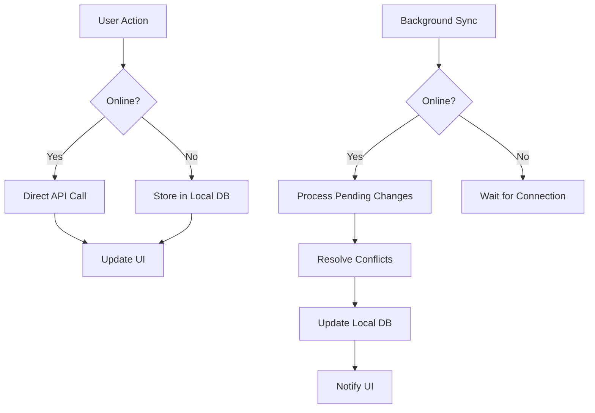

# Homecell Connect Hub - Architecture Design Specification

## Overview
This document outlines the comprehensive architecture design for the Homecell Connect Hub application, incorporating role-based access control (RBAC), hierarchical church structure, offline support, and mobile-first design patterns.

## 1. Enhanced State Management with RBAC

### Permissions Matrix

| Permission | Member | Leader | Assistant | Provider | Zonal | Area | District | Admin | Super Admin |
|------------|--------|--------|----------|----------|-------|------|----------|-------|------------|
| view_own_profile | ✓ | ✓ | ✓ | ✓ | ✓ | ✓ | ✓ | ✓ | ✓ |
| edit_own_profile | ✓ | ✓ | ✓ | ✓ | ✓ | ✓ | ✓ | ✓ | ✓ |
| view_homecell_members | ✓ | ✓ | ✓ | ✓ | ✓ | ✓ | ✓ | ✓ | ✓ |
| add_homecell_members | | ✓ | ✓ | ✓ | ✓ | ✓ | ✓ | ✓ | ✓ |
| edit_homecell_members | | ✓ | ✓ | ✓ | ✓ | ✓ | ✓ | ✓ | ✓ |
| mark_attendance | | ✓ | ✓ | ✓ | ✓ | ✓ | ✓ | ✓ | ✓ |
| view_homecell_reports | ✓ | ✓ | ✓ | ✓ | ✓ | ✓ | ✓ | ✓ | ✓ |
| submit_homecell_reports | | ✓ | ✓ | ✓ | ✓ | ✓ | ✓ | ✓ | ✓ |
| approve_homecell_reports | | | | | ✓ | ✓ | ✓ | ✓ | ✓ |
| view_zone_data | | | | | ✓ | ✓ | ✓ | ✓ | ✓ |
| manage_zone_data | | | | | ✓ | ✓ | ✓ | ✓ | ✓ |
| view_area_data | | | | | | ✓ | ✓ | ✓ | ✓ |
| manage_area_data | | | | | | ✓ | ✓ | ✓ | ✓ |
| view_district_data | | | | | | | ✓ | ✓ | ✓ |
| manage_district_data | | | | | | | ✓ | ✓ | ✓ |
| create_announcements | | | | | ✓ | ✓ | ✓ | ✓ | ✓ |
| system_admin | | | | | | | | ✓ | ✓ |
| super_admin | | | | | | | | | ✓ |

### State Management Architecture

```typescript
interface Permission {
  id: string;
  name: string;
  description: string;
}

interface RolePermissions {
  role: UserRole;
  permissions: Permission[];
  scope: 'homecell' | 'zone' | 'area' | 'district' | 'global';
}

interface RBACContextType {
  user: User | null;
  permissions: Permission[];
  hasPermission: (permission: string) => boolean;
  hasRole: (role: UserRole) => boolean;
  canAccessResource: (resourceType: string, resourceId: string) => boolean;
}
```

## 2. Hierarchical Church Structure Data Models

### Core Entities

```typescript
interface District {
  id: string;
  name: string;
  code: string;
  overseerId: string;
  overseerName: string;
  areaCount: number;
  totalMembers: number;
  createdAt: string;
  updatedAt: string;
}

interface Area {
  id: string;
  name: string;
  code: string;
  districtId: string;
  districtName: string;
  coordinatorId: string;
  coordinatorName: string;
  zoneCount: number;
  totalMembers: number;
  createdAt: string;
  updatedAt: string;
}

interface Zone {
  id: string;
  name: string;
  code: string;
  areaId: string;
  areaName: string;
  zonalLeaderId: string;
  zonalLeaderName: string;
  homecellCount: number;
  totalMembers: number;
  createdAt: string;
  updatedAt: string;
}

interface Homecell {
  id: string;
  name: string;
  code: string;
  address: string;
  meetingDay: string;
  meetingTime: string;
  leaderId: string;
  leaderName: string;
  assistantId?: string;
  assistantName?: string;
  providerId?: string;
  providerName?: string;
  zoneId: string;
  zoneName: string;
  areaId: string;
  areaName: string;
  districtId: string;
  districtName: string;
  memberCount: number;
  createdAt: string;
  updatedAt: string;
}

interface User {
  id: string;
  name: string;
  phone: string;
  email?: string;
  role: UserRole;
  avatar?: string;
  homecellId?: string;
  homecellName?: string;
  zoneId?: string;
  zoneName?: string;
  areaId?: string;
  areaName?: string;
  districtId?: string;
  districtName?: string;
  permissions: Permission[];
  isActive: boolean;
  lastLoginAt?: string;
  createdAt: string;
  updatedAt: string;
}
```

### Hierarchy Context

```typescript
interface HierarchyContextType {
  districts: District[];
  areas: Area[];
  zones: Zone[];
  homecells: Homecell[];
  currentUserHierarchy: {
    district?: District;
    area?: Area;
    zone?: Zone;
    homecell?: Homecell;
  };
  getSubordinates: (level: 'district' | 'area' | 'zone' | 'homecell') => any[];
  getAccessibleResources: (resourceType: string) => any[];
}
```

## 3. Role-Based Routing and Navigation

### Route Protection Architecture

```typescript
interface ProtectedRouteProps {
  children: React.ReactNode;
  requiredPermissions?: string[];
  requiredRoles?: UserRole[];
  fallbackPath?: string;
}

interface RouteConfig {
  path: string;
  component: React.ComponentType;
  permissions?: string[];
  roles?: UserRole[];
  title: string;
  icon?: React.ComponentType;
  children?: RouteConfig[];
}
```

### Navigation Structure by Role

**Leader/Assistant/Provider:**
- Dashboard (homecell stats)
- Members (homecell only)
- Attendance (homecell only)
- Reports (homecell submission)
- Materials (view/download)
- Announcements (view)

**Zonal Leader:**
- Dashboard (zone overview)
- Homecells (zone management)
- Reports (zone approval)
- Members (zone-wide view)
- Attendance (zone analytics)
- Announcements (zone creation)

**Area Coordinator:**
- Dashboard (area overview)
- Zones (area management)
- Reports (area approval)
- Analytics (area metrics)
- Announcements (area-wide)

**District Overseer:**
- Dashboard (district overview)
- Areas (district management)
- Reports (district approval)
- Analytics (district metrics)
- System Settings

**Admin/Super Admin:**
- All district data
- User management
- System configuration
- Audit logs

## 4. Component Architecture for Role-Specific Dashboards

### Shared Components

```typescript
// Base dashboard layout
interface DashboardLayoutProps {
  title: string;
  stats: DashboardStat[];
  quickActions: QuickAction[];
  children: React.ReactNode;
}

// Role-specific dashboard components
interface LeaderDashboardProps extends DashboardLayoutProps {
  homecellData: Homecell;
  attendanceStats: AttendanceStats;
  pendingTasks: Task[];
}

interface ZonalDashboardProps extends DashboardLayoutProps {
  zoneData: Zone;
  homecellStats: HomecellStats[];
  approvalQueue: Report[];
}

// Reusable widgets
interface StatCardProps {
  title: string;
  value: string | number;
  change?: number;
  icon: React.ComponentType;
  trend?: 'up' | 'down' | 'neutral';
}

interface QuickActionGridProps {
  actions: QuickAction[];
  onActionClick: (action: QuickAction) => void;
}
```

### Component Hierarchy

```
Dashboard/
├── Shared/
│   ├── StatCard.tsx
│   ├── QuickActionGrid.tsx
│   ├── AnnouncementList.tsx
│   └── ActivityFeed.tsx
├── Leader/
│   ├── LeaderDashboard.tsx
│   ├── HomecellStats.tsx
│   └── AttendanceChart.tsx
├── Zonal/
│   ├── ZonalDashboard.tsx
│   ├── ZoneOverview.tsx
│   └── HomecellGrid.tsx
├── Area/
│   ├── AreaDashboard.tsx
│   ├── AreaAnalytics.tsx
│   └── ZoneList.tsx
└── District/
    ├── DistrictDashboard.tsx
    ├── DistrictMetrics.tsx
    └── AreaGrid.tsx
```

## 5. Offline Support Architecture

### Local Storage Strategy

```typescript
interface OfflineStorage {
  // User data
  user: User;
  permissions: Permission[];
  
  // Cached data
  members: Member[];
  attendance: AttendanceRecord[];
  reports: WeeklyReport[];
  announcements: Announcement[];
  materials: Material[];
  
  // Sync metadata
  lastSyncAt: string;
  pendingChanges: PendingChange[];
  syncConflicts: SyncConflict[];
}

interface PendingChange {
  id: string;
  type: 'create' | 'update' | 'delete';
  entityType: string;
  entityId: string;
  data: any;
  timestamp: string;
  retryCount: number;
}

interface SyncConflict {
  id: string;
  entityType: string;
  entityId: string;
  localData: any;
  serverData: any;
  resolved: boolean;
  resolution?: 'local' | 'server' | 'merge';
}
```

### Sync Mechanism

```typescript
interface SyncManager {
  isOnline: boolean;
  isSyncing: boolean;
  lastSyncAt: string;
  
  sync(): Promise<SyncResult>;
  queueChange(change: PendingChange): void;
  resolveConflict(conflictId: string, resolution: ConflictResolution): void;
}

interface SyncResult {
  success: boolean;
  syncedItems: number;
  conflicts: SyncConflict[];
  errors: string[];
}
```

### Offline-First Data Flow



## 6. API Integration Patterns

### RESTful API Structure

```
/api/v1/
├── auth/
│   ├── login
│   ├── verify-otp
│   └── refresh
├── users/
│   ├── profile
│   ├── permissions
│   └── hierarchy
├── members/
│   ├── {homecellId}
│   ├── {memberId}
│   └── bulk-import
├── attendance/
│   ├── mark
│   ├── {homecellId}/history
│   └── reports
├── reports/
│   ├── submit
│   ├── {reportId}/approve
│   └── analytics
├── announcements/
│   ├── create
│   ├── {announcementId}
│   └── by-audience
├── materials/
│   ├── upload
│   ├── {materialId}/download
│   └── categories
└── hierarchy/
    ├── districts
    ├── areas
    ├── zones
    └── homecells
```

### API Client Architecture

```typescript
interface ApiClient {
  baseURL: string;
  authToken?: string;
  
  get<T>(endpoint: string, params?: any): Promise<ApiResponse<T>>;
  post<T>(endpoint: string, data: any): Promise<ApiResponse<T>>;
  put<T>(endpoint: string, data: any): Promise<ApiResponse<T>>;
  delete<T>(endpoint: string): Promise<ApiResponse<T>>;
}

interface ApiResponse<T> {
  data: T;
  success: boolean;
  message?: string;
  errors?: string[];
  meta?: {
    pagination?: PaginationMeta;
    timestamp: string;
  };
}

interface ApiError {
  code: string;
  message: string;
  details?: any;
  retryable: boolean;
}
```

### Error Handling & Retry Logic

```typescript
class ApiErrorHandler {
  static handle(error: ApiError): void {
    switch (error.code) {
      case 'NETWORK_ERROR':
        // Queue for retry
        break;
      case 'AUTH_ERROR':
        // Redirect to login
        break;
      case 'PERMISSION_DENIED':
        // Show permission error
        break;
      case 'VALIDATION_ERROR':
        // Show validation messages
        break;
      default:
        // Generic error handling
        break;
    }
  }
}
```

### Caching Strategy

```typescript
interface CacheConfig {
  ttl: number; // Time to live in seconds
  maxSize: number; // Maximum cache size
  strategy: 'LRU' | 'LFU' | 'FIFO';
}

class ApiCache {
  get<T>(key: string): T | null;
  set<T>(key: string, value: T, config?: Partial<CacheConfig>): void;
  invalidate(pattern: string): void;
  clear(): void;
}
```

## 7. Component Reusability and Mobile-First Design

### Design System Components

```typescript
// Atomic components
interface ButtonProps {
  variant: 'primary' | 'secondary' | 'outline' | 'ghost';
  size: 'sm' | 'md' | 'lg';
  loading?: boolean;
  disabled?: boolean;
  fullWidth?: boolean;
  children: React.ReactNode;
  onClick?: () => void;
}

interface CardProps {
  title?: string;
  subtitle?: string;
  actions?: React.ReactNode;
  children: React.ReactNode;
  variant?: 'default' | 'elevated' | 'outlined';
  padding?: 'sm' | 'md' | 'lg';
}

// Layout components
interface MobileLayoutProps {
  header?: React.ReactNode;
  footer?: React.ReactNode;
  children: React.ReactNode;
  safeArea?: boolean;
}

interface ResponsiveGridProps {
  columns: {
    mobile: number;
    tablet: number;
    desktop: number;
  };
  gap: string;
  children: React.ReactNode;
}
```

### Mobile-First Responsive Patterns

```scss
// Breakpoints
$mobile: 320px;
$tablet: 768px;
$desktop: 1024px;

// Responsive utilities
.container {
  width: 100%;
  max-width: $mobile;
  margin: 0 auto;
  padding: 0 1rem;
  
  @media (min-width: $tablet) {
    max-width: $tablet;
    padding: 0 2rem;
  }
  
  @media (min-width: $desktop) {
    max-width: $desktop;
    padding: 0 3rem;
  }
}

// Touch-friendly interactions
.press-effect {
  transition: transform 0.1s ease;
  
  &:active {
    transform: scale(0.98);
  }
}

// Safe area handling
.safe-area-top {
  padding-top: env(safe-area-inset-top);
}

.safe-area-bottom {
  padding-bottom: env(safe-area-inset-bottom);
}
```

### Reusable Hooks

```typescript
// Data fetching with caching
function useApiQuery<T>(
  endpoint: string,
  options?: {
    enabled?: boolean;
    refetchInterval?: number;
    cacheTime?: number;
  }
): {
  data: T | undefined;
  isLoading: boolean;
  error: Error | null;
  refetch: () => void;
};

// Permission checking
function usePermissions(): {
  hasPermission: (permission: string) => boolean;
  hasRole: (role: UserRole) => boolean;
  canAccess: (resource: string, id?: string) => boolean;
};

// Offline detection
function useOfflineStatus(): {
  isOnline: boolean;
  wasOffline: boolean;
  reconnect: () => void;
};
```

## Implementation Roadmap

### Phase 1: Core Infrastructure
1. Implement RBAC system with permissions matrix
2. Create hierarchical data models
3. Set up enhanced state management
4. Implement protected routing

### Phase 2: Role-Specific Features
1. Build role-specific dashboard components
2. Implement navigation guards
3. Create permission-based UI rendering

### Phase 3: Offline & Sync
1. Implement local storage layer
2. Build sync mechanisms
3. Add conflict resolution

### Phase 4: API Integration
1. Create API client with error handling
2. Implement caching layer
3. Add retry logic and offline queuing

### Phase 5: Polish & Optimization
1. Component reusability audit
2. Performance optimization
3. Mobile UX enhancements

## Conclusion

This architecture provides a scalable, secure, and user-friendly foundation for the Homecell Connect Hub application. The RBAC system ensures proper access control, while the hierarchical structure supports the church's organizational needs. Offline support and robust API integration ensure reliability across varying network conditions.